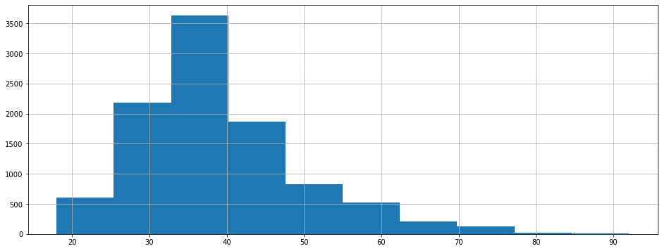
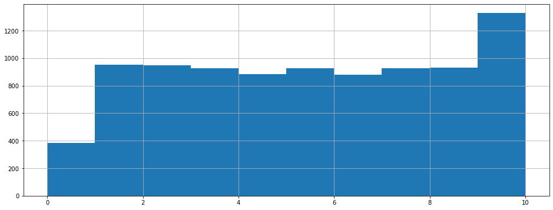
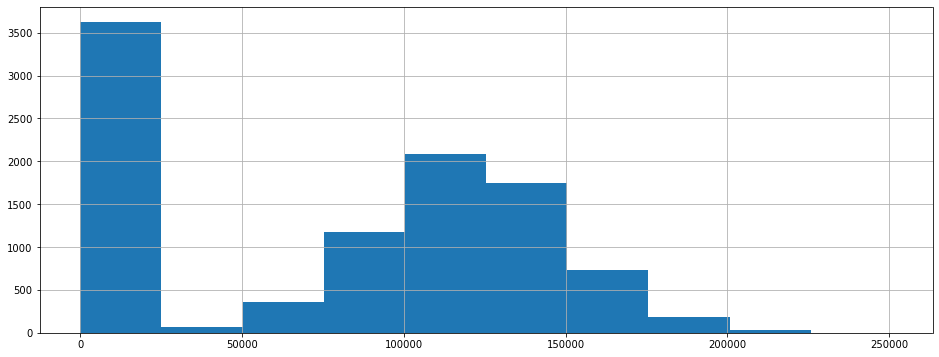
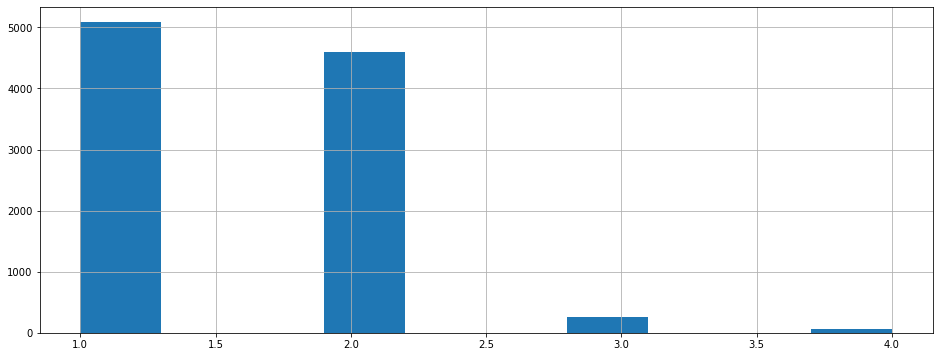
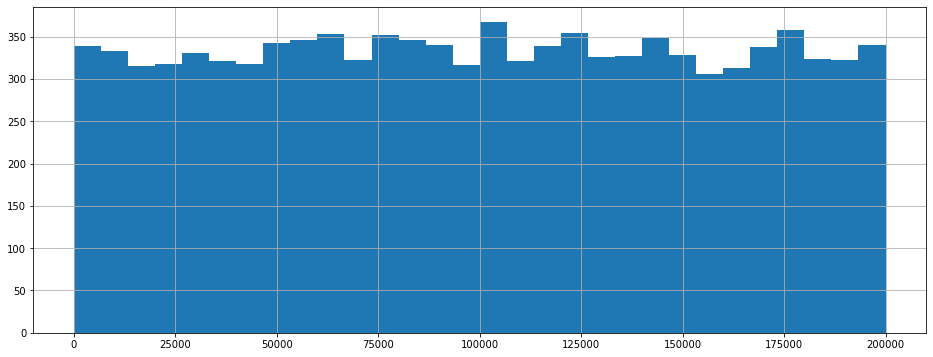

<h1>Содержание<span class="tocSkip"></span></h1>
<div class="toc"><ul class="toc-item"><li><span><a href="#Подготовка-данных" data-toc-modified-id="Подготовка-данных-1"><span class="toc-item-num">1&nbsp;&nbsp;</span>Подготовка данных</a></span><ul class="toc-item"><li><span><a href="#Выводы-о-природе-данных-после-ознакомления" data-toc-modified-id="Выводы-о-природе-данных-после-ознакомления-1.1"><span class="toc-item-num">1.1&nbsp;&nbsp;</span>Выводы о природе данных после ознакомления</a></span></li></ul></li><li><span><a href="#Исследование-задачи" data-toc-modified-id="Исследование-задачи-2"><span class="toc-item-num">2&nbsp;&nbsp;</span>Исследование задачи</a></span><ul class="toc-item"><li><span><a href="#Решающее-дерево" data-toc-modified-id="Решающее-дерево-2.1"><span class="toc-item-num">2.1&nbsp;&nbsp;</span>Решающее дерево</a></span></li><li><span><a href="#Случайный-лес" data-toc-modified-id="Случайный-лес-2.2"><span class="toc-item-num">2.2&nbsp;&nbsp;</span>Случайный лес</a></span></li><li><span><a href="#Логистическая-регрессия" data-toc-modified-id="Логистическая-регрессия-2.3"><span class="toc-item-num">2.3&nbsp;&nbsp;</span>Логистическая регрессия</a></span></li><li><span><a href="#Выводы-по-обучению-модели-без-учета-дисбаланса-классов" data-toc-modified-id="Выводы-по-обучению-модели-без-учета-дисбаланса-классов-2.4"><span class="toc-item-num">2.4&nbsp;&nbsp;</span>Выводы по обучению модели без учета дисбаланса классов</a></span></li></ul></li><li><span><a href="#Борьба-с-дисбалансом" data-toc-modified-id="Борьба-с-дисбалансом-3"><span class="toc-item-num">3&nbsp;&nbsp;</span>Борьба с дисбалансом</a></span><ul class="toc-item"><li><span><a href="#Промежуточные-выводы-по-балансировке-классов-через-параметр-class_weight" data-toc-modified-id="Промежуточные-выводы-по-балансировке-классов-через-параметр-class_weight-3.1"><span class="toc-item-num">3.1&nbsp;&nbsp;</span>Промежуточные выводы по балансировке классов через параметр class_weight</a></span></li><li><span><a href="#Тестирование-подхода-upsampling'a" data-toc-modified-id="Тестирование-подхода-upsampling'a-3.2"><span class="toc-item-num">3.2&nbsp;&nbsp;</span>Тестирование подхода upsampling'a</a></span></li><li><span><a href="#Промежуточные-выводы-по-результатам-применения-техники-увеличения-выборки" data-toc-modified-id="Промежуточные-выводы-по-результатам-применения-техники-увеличения-выборки-3.3"><span class="toc-item-num">3.3&nbsp;&nbsp;</span>Промежуточные выводы по результатам применения техники увеличения выборки</a></span></li><li><span><a href="#Тестирование-подхода-downsampling'a" data-toc-modified-id="Тестирование-подхода-downsampling'a-3.4"><span class="toc-item-num">3.4&nbsp;&nbsp;</span>Тестирование подхода downsampling'a</a></span></li><li><span><a href="#Промежуточные-выводы-по-результатам-применения-техники-уменьшения-выборки" data-toc-modified-id="Промежуточные-выводы-по-результатам-применения-техники-уменьшения-выборки-3.5"><span class="toc-item-num">3.5&nbsp;&nbsp;</span>Промежуточные выводы по результатам применения техники уменьшения выборки</a></span></li></ul></li><li><span><a href="#Тестирование-модели" data-toc-modified-id="Тестирование-модели-4"><span class="toc-item-num">4&nbsp;&nbsp;</span>Тестирование модели</a></span></li><li><span><a href="#Финальные-выводы" data-toc-modified-id="Финальные-выводы-5"><span class="toc-item-num">5&nbsp;&nbsp;</span>Финальные выводы</a></span></li><li><span><a href="#Чек-лист-готовности-проекта" data-toc-modified-id="Чек-лист-готовности-проекта-6"><span class="toc-item-num">6&nbsp;&nbsp;</span>Чек-лист готовности проекта</a></span></li></ul></div>

# Отток клиентов

Из «Бета-Банка» стали уходить клиенты. Каждый месяц. Немного, но заметно. Банковские маркетологи посчитали: сохранять текущих клиентов дешевле, чем привлекать новых.

Нужно спрогнозировать, уйдёт клиент из банка в ближайшее время или нет. Вам предоставлены исторические данные о поведении клиентов и расторжении договоров с банком. 

Постройте модель с предельно большим значением *F1*-меры. Чтобы сдать проект успешно, нужно довести метрику до 0.59. Проверьте *F1*-меру на тестовой выборке самостоятельно.

Дополнительно измеряйте *AUC-ROC*, сравнивайте её значение с *F1*-мерой.

Источник данных: [https://www.kaggle.com/barelydedicated/bank-customer-churn-modeling](https://www.kaggle.com/barelydedicated/bank-customer-churn-modeling)

## Подготовка данных

*Сперва мы импортируем необходимые рабочие библиотеки, без них невозможно начать работу. В данном проекте нам необходимо предсказать уход клиента, который закодирован в столбце **Exited** по булеву принципу через единицы и нули, поэтому наша задача сводится к бинарной классификации, ведь нам надо предсказать при помощи модели уход/неуход клиента. Опираясь на эту информацию, ниже мы импортируем основные классификационные модели - решающего дерева, случайного леса и логистической регресии*


```python
#импортируем необходимые библиотеки
import pandas as pd
import numpy as np
import seaborn as sns
#импортируем библиотеки моделей классификации
from sklearn.tree import DecisionTreeClassifier
from sklearn.ensemble import RandomForestClassifier
from sklearn.linear_model import LogisticRegression
from sklearn.model_selection import train_test_split
from sklearn.model_selection import GridSearchCV
from sklearn.utils import shuffle
#импортируем библиотеки метрик для проекта
from sklearn.metrics import roc_auc_score
from sklearn.metrics import f1_score
```


```python
#откроем и изучим файл
try:
    data = pd.read_csv('/datasets/Churn.csv')
except:
    data = pd.read_csv('D:/datasets/Churn.csv')
```


```python
data.head(12) #data.tail(12) #data.sample(12)
```


<div>
<style scoped>
    .dataframe tbody tr th:only-of-type {
        vertical-align: middle;
    }

    .dataframe tbody tr th {
        vertical-align: top;
    }

    .dataframe thead th {
        text-align: right;
    }
</style>
<table border="1" class="dataframe">
  <thead>
    <tr style="text-align: right;">
      <th></th>
      <th>RowNumber</th>
      <th>CustomerId</th>
      <th>Surname</th>
      <th>CreditScore</th>
      <th>Geography</th>
      <th>Gender</th>
      <th>Age</th>
      <th>Tenure</th>
      <th>Balance</th>
      <th>NumOfProducts</th>
      <th>HasCrCard</th>
      <th>IsActiveMember</th>
      <th>EstimatedSalary</th>
      <th>Exited</th>
    </tr>
  </thead>
  <tbody>
    <tr>
      <th>0</th>
      <td>1</td>
      <td>15634602</td>
      <td>Hargrave</td>
      <td>619</td>
      <td>France</td>
      <td>Female</td>
      <td>42</td>
      <td>2.0</td>
      <td>0.00</td>
      <td>1</td>
      <td>1</td>
      <td>1</td>
      <td>101348.88</td>
      <td>1</td>
    </tr>
    <tr>
      <th>1</th>
      <td>2</td>
      <td>15647311</td>
      <td>Hill</td>
      <td>608</td>
      <td>Spain</td>
      <td>Female</td>
      <td>41</td>
      <td>1.0</td>
      <td>83807.86</td>
      <td>1</td>
      <td>0</td>
      <td>1</td>
      <td>112542.58</td>
      <td>0</td>
    </tr>
    <tr>
      <th>2</th>
      <td>3</td>
      <td>15619304</td>
      <td>Onio</td>
      <td>502</td>
      <td>France</td>
      <td>Female</td>
      <td>42</td>
      <td>8.0</td>
      <td>159660.80</td>
      <td>3</td>
      <td>1</td>
      <td>0</td>
      <td>113931.57</td>
      <td>1</td>
    </tr>
    <tr>
      <th>3</th>
      <td>4</td>
      <td>15701354</td>
      <td>Boni</td>
      <td>699</td>
      <td>France</td>
      <td>Female</td>
      <td>39</td>
      <td>1.0</td>
      <td>0.00</td>
      <td>2</td>
      <td>0</td>
      <td>0</td>
      <td>93826.63</td>
      <td>0</td>
    </tr>
    <tr>
      <th>4</th>
      <td>5</td>
      <td>15737888</td>
      <td>Mitchell</td>
      <td>850</td>
      <td>Spain</td>
      <td>Female</td>
      <td>43</td>
      <td>2.0</td>
      <td>125510.82</td>
      <td>1</td>
      <td>1</td>
      <td>1</td>
      <td>79084.10</td>
      <td>0</td>
    </tr>
    <tr>
      <th>5</th>
      <td>6</td>
      <td>15574012</td>
      <td>Chu</td>
      <td>645</td>
      <td>Spain</td>
      <td>Male</td>
      <td>44</td>
      <td>8.0</td>
      <td>113755.78</td>
      <td>2</td>
      <td>1</td>
      <td>0</td>
      <td>149756.71</td>
      <td>1</td>
    </tr>
    <tr>
      <th>6</th>
      <td>7</td>
      <td>15592531</td>
      <td>Bartlett</td>
      <td>822</td>
      <td>France</td>
      <td>Male</td>
      <td>50</td>
      <td>7.0</td>
      <td>0.00</td>
      <td>2</td>
      <td>1</td>
      <td>1</td>
      <td>10062.80</td>
      <td>0</td>
    </tr>
    <tr>
      <th>7</th>
      <td>8</td>
      <td>15656148</td>
      <td>Obinna</td>
      <td>376</td>
      <td>Germany</td>
      <td>Female</td>
      <td>29</td>
      <td>4.0</td>
      <td>115046.74</td>
      <td>4</td>
      <td>1</td>
      <td>0</td>
      <td>119346.88</td>
      <td>1</td>
    </tr>
    <tr>
      <th>8</th>
      <td>9</td>
      <td>15792365</td>
      <td>He</td>
      <td>501</td>
      <td>France</td>
      <td>Male</td>
      <td>44</td>
      <td>4.0</td>
      <td>142051.07</td>
      <td>2</td>
      <td>0</td>
      <td>1</td>
      <td>74940.50</td>
      <td>0</td>
    </tr>
    <tr>
      <th>9</th>
      <td>10</td>
      <td>15592389</td>
      <td>H?</td>
      <td>684</td>
      <td>France</td>
      <td>Male</td>
      <td>27</td>
      <td>2.0</td>
      <td>134603.88</td>
      <td>1</td>
      <td>1</td>
      <td>1</td>
      <td>71725.73</td>
      <td>0</td>
    </tr>
    <tr>
      <th>10</th>
      <td>11</td>
      <td>15767821</td>
      <td>Bearce</td>
      <td>528</td>
      <td>France</td>
      <td>Male</td>
      <td>31</td>
      <td>6.0</td>
      <td>102016.72</td>
      <td>2</td>
      <td>0</td>
      <td>0</td>
      <td>80181.12</td>
      <td>0</td>
    </tr>
    <tr>
      <th>11</th>
      <td>12</td>
      <td>15737173</td>
      <td>Andrews</td>
      <td>497</td>
      <td>Spain</td>
      <td>Male</td>
      <td>24</td>
      <td>3.0</td>
      <td>0.00</td>
      <td>2</td>
      <td>1</td>
      <td>0</td>
      <td>76390.01</td>
      <td>0</td>
    </tr>
  </tbody>
</table>
</div>


```python
data.shape
```


    (10000, 14)


```python
data.info()
```

    <class 'pandas.core.frame.DataFrame'>
    RangeIndex: 10000 entries, 0 to 9999
    Data columns (total 14 columns):
     #   Column           Non-Null Count  Dtype  
    ---  ------           --------------  -----  
     0   RowNumber        10000 non-null  int64  
     1   CustomerId       10000 non-null  int64  
     2   Surname          10000 non-null  object 
     3   CreditScore      10000 non-null  int64  
     4   Geography        10000 non-null  object 
     5   Gender           10000 non-null  object 
     6   Age              10000 non-null  int64  
     7   Tenure           9091 non-null   float64
     8   Balance          10000 non-null  float64
     9   NumOfProducts    10000 non-null  int64  
     10  HasCrCard        10000 non-null  int64  
     11  IsActiveMember   10000 non-null  int64  
     12  EstimatedSalary  10000 non-null  float64
     13  Exited           10000 non-null  int64  
    dtypes: float64(3), int64(8), object(3)
    memory usage: 1.1+ MB
    

**Визиализируем признаки, которые играют большую роль в предсказании оттока клиентов** 


```python
#возраст клиента
data['Age'].hist(figsize=(16,6));
```


    

    


```python
#продолжительность пользования услугами банка
data['Tenure'].hist(figsize=(16,6));
```


    

    


```python
#кол-во средств на счету
data['Balance'].hist(figsize=(16,6));
```


    

    


```python
#кол-во подключенных услуг/продуктов банка на клиента
data['NumOfProducts'].hist(figsize=(16,6));
```


    

    


```python
#предполагаема зарплата
data['EstimatedSalary'].hist(figsize=(16,6), bins=30);
```


    

    


```python
#изучим статистику по численным признакам
#исключим строковые и булевы признаки
data[['Age', 'Tenure', 'Balance', 'NumOfProducts', 'EstimatedSalary']].describe()
```


<div>
<style scoped>
    .dataframe tbody tr th:only-of-type {
        vertical-align: middle;
    }

    .dataframe tbody tr th {
        vertical-align: top;
    }

    .dataframe thead th {
        text-align: right;
    }
</style>
<table border="1" class="dataframe">
  <thead>
    <tr style="text-align: right;">
      <th></th>
      <th>Age</th>
      <th>Tenure</th>
      <th>Balance</th>
      <th>NumOfProducts</th>
      <th>EstimatedSalary</th>
    </tr>
  </thead>
  <tbody>
    <tr>
      <th>count</th>
      <td>10000.000000</td>
      <td>9091.000000</td>
      <td>10000.000000</td>
      <td>10000.000000</td>
      <td>10000.000000</td>
    </tr>
    <tr>
      <th>mean</th>
      <td>38.921800</td>
      <td>4.997690</td>
      <td>76485.889288</td>
      <td>1.530200</td>
      <td>100090.239881</td>
    </tr>
    <tr>
      <th>std</th>
      <td>10.487806</td>
      <td>2.894723</td>
      <td>62397.405202</td>
      <td>0.581654</td>
      <td>57510.492818</td>
    </tr>
    <tr>
      <th>min</th>
      <td>18.000000</td>
      <td>0.000000</td>
      <td>0.000000</td>
      <td>1.000000</td>
      <td>11.580000</td>
    </tr>
    <tr>
      <th>25%</th>
      <td>32.000000</td>
      <td>2.000000</td>
      <td>0.000000</td>
      <td>1.000000</td>
      <td>51002.110000</td>
    </tr>
    <tr>
      <th>50%</th>
      <td>37.000000</td>
      <td>5.000000</td>
      <td>97198.540000</td>
      <td>1.000000</td>
      <td>100193.915000</td>
    </tr>
    <tr>
      <th>75%</th>
      <td>44.000000</td>
      <td>7.000000</td>
      <td>127644.240000</td>
      <td>2.000000</td>
      <td>149388.247500</td>
    </tr>
    <tr>
      <th>max</th>
      <td>92.000000</td>
      <td>10.000000</td>
      <td>250898.090000</td>
      <td>4.000000</td>
      <td>199992.480000</td>
    </tr>
  </tbody>
</table>
</div>


```python
data.isna().mean()
```


    RowNumber          0.0000
    CustomerId         0.0000
    Surname            0.0000
    CreditScore        0.0000
    Geography          0.0000
    Gender             0.0000
    Age                0.0000
    Tenure             0.0909
    Balance            0.0000
    NumOfProducts      0.0000
    HasCrCard          0.0000
    IsActiveMember     0.0000
    EstimatedSalary    0.0000
    Exited             0.0000
    dtype: float64


```python
tenure_median = data['Tenure'].median()
```


```python
data['Tenure'] = data['Tenure'].fillna(tenure_median)
```

### Выводы о природе данных после ознакомления

* Мы имеем дело с данными клиентов банка. В нашем датасете представлены 14 показателей и 10000 значений. 
* На первый взгляд значения в столбцах имеют подходящие типы, строковых значений не так много: только для фамилий, пола и страны проживания. Поэтому преобразования типов не потребуются.
* Графа возраста демонстрирует, что у банка есть клиенты самых разных возрастов: в среднем им около 39 лет, судя по квартилям большей части от 30 до 45 лет, в то время, как самому молодому всего 18 лет(вполне логично), а самому пожилому 92 года.
* Также вызывает интерес столбец с продолжительностью сотрудничества с банком('Tenure'): в среднем клиенты пользуются нашими услугами 5 лет, граница первого квартиля проходит по границе 2 года, т.е. четверть клиентов работает с нами от 2х лет и меньше. А 25% процентов самых лояльных клиентов доверяет нам свои средства от 7 лет и дольше. Максимальный срок пользования нашими услугами составил 10 лет и таких клиентов много(см. график выше).  
* Баланс на счете тоже может играть важную роль в работе нашей модели, ведь по этой сумме можно судить о достатке клиента, а также к уровню доверия к банку. В среднем наш клиент хранит около 76,5 тыс. на своем счету, примерно половина имеет там около 100 тыс. или меньше(граница второго квартиля 97,2 тыс, она же медиана), а максимальные суммы совокупных средств на счету достигают четверти миллиона. Но в целом кол-во средств на счету распределено очень равномерно, без выбросов.
* Не очень подробной, но довольно красноречивой метрикой можно назвать количество продуктов банка у клиента: в среднем клиент имеет один продукт банка, вероятнее всего карту и счет. Примерно четверть наших клиентов имеет от 1 до 2х продуктов, а максимум для этого показателя - 4 продукта.
* Также, как и кол-во средств на счету, нашей модели многое может сказать примерный доход клиента. Здесть также наблюдается большой разброс: в среднем наши клиенты получают 100 тыс. Минимальный показатель составил 11,58, видимо, здесь имеет место ошибка или почасовая плата. Максимальный доход составил 200 тыс., что превышает средний и медианный показатель вдвое.
* Пропусков в данных почти нет, лишь несколько значений в графе "кол-во лет использования услуг банка"

## Исследование задачи

**Прежде чем перейти к обучению модели и подбору оптимальных гиперпараметров, мы изучим целевой признак на предмет сбалансированности**


```python
#посмотрим на баланс целевого признака, который необходимо предсказывать
data['Exited'].value_counts()
```


    0    7963
    1    2037
    Name: Exited, dtype: int64


*Мы наблюдаем несбалансированность в целевом признаке, те, кто остался преобладают в соотношении 3:1 к тем, кто расторг контракт с банком* 
Но на данном этапе мы проигнорируем это обстоятельство и займемся обучением модели, а затем поработаем с балансом классов.


```python
data['Geography'].unique()
```


    array(['France', 'Spain', 'Germany'], dtype=object)


Похоже, что далеко не все столбцы будут полезны для обучения наших моделей, поэтому столбцы с номером ряда и фамилией целесообразно просто исключить из набора признаков для обучения, а значения "страны проживания" мы закодируем в виде числовых соответствий техникой One-hot encoding, поскольку уникальных значений в нем всего 3(см. выше)


```python
#создаем дамми-переменные в отдельной переменной
dummy = pd.get_dummies(data['Geography'], drop_first=True)
```


```python
#проверяем
dummy.head()
```


<div>
<style scoped>
    .dataframe tbody tr th:only-of-type {
        vertical-align: middle;
    }

    .dataframe tbody tr th {
        vertical-align: top;
    }

    .dataframe thead th {
        text-align: right;
    }
</style>
<table border="1" class="dataframe">
  <thead>
    <tr style="text-align: right;">
      <th></th>
      <th>Germany</th>
      <th>Spain</th>
    </tr>
  </thead>
  <tbody>
    <tr>
      <th>0</th>
      <td>0</td>
      <td>0</td>
    </tr>
    <tr>
      <th>1</th>
      <td>0</td>
      <td>1</td>
    </tr>
    <tr>
      <th>2</th>
      <td>0</td>
      <td>0</td>
    </tr>
    <tr>
      <th>3</th>
      <td>0</td>
      <td>0</td>
    </tr>
    <tr>
      <th>4</th>
      <td>0</td>
      <td>1</td>
    </tr>
  </tbody>
</table>
</div>


```python
#добавим новые столбцы к датасету
data = pd.concat([data, dummy], axis=1)
```


```python
#теперь закодируем аналогичным образом пол клиентов
#так данные должны занимать меньше места
dummy_gender = pd.get_dummies(data['Gender'], drop_first=True)
```


```python
dummy_gender.sample(12)
```


<div>
<style scoped>
    .dataframe tbody tr th:only-of-type {
        vertical-align: middle;
    }

    .dataframe tbody tr th {
        vertical-align: top;
    }

    .dataframe thead th {
        text-align: right;
    }
</style>
<table border="1" class="dataframe">
  <thead>
    <tr style="text-align: right;">
      <th></th>
      <th>Male</th>
    </tr>
  </thead>
  <tbody>
    <tr>
      <th>9729</th>
      <td>1</td>
    </tr>
    <tr>
      <th>1047</th>
      <td>0</td>
    </tr>
    <tr>
      <th>6362</th>
      <td>1</td>
    </tr>
    <tr>
      <th>1336</th>
      <td>1</td>
    </tr>
    <tr>
      <th>3514</th>
      <td>0</td>
    </tr>
    <tr>
      <th>2531</th>
      <td>1</td>
    </tr>
    <tr>
      <th>5750</th>
      <td>1</td>
    </tr>
    <tr>
      <th>5408</th>
      <td>0</td>
    </tr>
    <tr>
      <th>5716</th>
      <td>1</td>
    </tr>
    <tr>
      <th>5516</th>
      <td>1</td>
    </tr>
    <tr>
      <th>6056</th>
      <td>1</td>
    </tr>
    <tr>
      <th>4654</th>
      <td>0</td>
    </tr>
  </tbody>
</table>
</div>


```python
data = pd.concat([data, dummy_gender], axis=1)
```


```python
#проверим результат
data.head(8)
```


<div>
<style scoped>
    .dataframe tbody tr th:only-of-type {
        vertical-align: middle;
    }

    .dataframe tbody tr th {
        vertical-align: top;
    }

    .dataframe thead th {
        text-align: right;
    }
</style>
<table border="1" class="dataframe">
  <thead>
    <tr style="text-align: right;">
      <th></th>
      <th>RowNumber</th>
      <th>CustomerId</th>
      <th>Surname</th>
      <th>CreditScore</th>
      <th>Geography</th>
      <th>Gender</th>
      <th>Age</th>
      <th>Tenure</th>
      <th>Balance</th>
      <th>NumOfProducts</th>
      <th>HasCrCard</th>
      <th>IsActiveMember</th>
      <th>EstimatedSalary</th>
      <th>Exited</th>
      <th>Germany</th>
      <th>Spain</th>
      <th>Male</th>
    </tr>
  </thead>
  <tbody>
    <tr>
      <th>0</th>
      <td>1</td>
      <td>15634602</td>
      <td>Hargrave</td>
      <td>619</td>
      <td>France</td>
      <td>Female</td>
      <td>42</td>
      <td>2.0</td>
      <td>0.00</td>
      <td>1</td>
      <td>1</td>
      <td>1</td>
      <td>101348.88</td>
      <td>1</td>
      <td>0</td>
      <td>0</td>
      <td>0</td>
    </tr>
    <tr>
      <th>1</th>
      <td>2</td>
      <td>15647311</td>
      <td>Hill</td>
      <td>608</td>
      <td>Spain</td>
      <td>Female</td>
      <td>41</td>
      <td>1.0</td>
      <td>83807.86</td>
      <td>1</td>
      <td>0</td>
      <td>1</td>
      <td>112542.58</td>
      <td>0</td>
      <td>0</td>
      <td>1</td>
      <td>0</td>
    </tr>
    <tr>
      <th>2</th>
      <td>3</td>
      <td>15619304</td>
      <td>Onio</td>
      <td>502</td>
      <td>France</td>
      <td>Female</td>
      <td>42</td>
      <td>8.0</td>
      <td>159660.80</td>
      <td>3</td>
      <td>1</td>
      <td>0</td>
      <td>113931.57</td>
      <td>1</td>
      <td>0</td>
      <td>0</td>
      <td>0</td>
    </tr>
    <tr>
      <th>3</th>
      <td>4</td>
      <td>15701354</td>
      <td>Boni</td>
      <td>699</td>
      <td>France</td>
      <td>Female</td>
      <td>39</td>
      <td>1.0</td>
      <td>0.00</td>
      <td>2</td>
      <td>0</td>
      <td>0</td>
      <td>93826.63</td>
      <td>0</td>
      <td>0</td>
      <td>0</td>
      <td>0</td>
    </tr>
    <tr>
      <th>4</th>
      <td>5</td>
      <td>15737888</td>
      <td>Mitchell</td>
      <td>850</td>
      <td>Spain</td>
      <td>Female</td>
      <td>43</td>
      <td>2.0</td>
      <td>125510.82</td>
      <td>1</td>
      <td>1</td>
      <td>1</td>
      <td>79084.10</td>
      <td>0</td>
      <td>0</td>
      <td>1</td>
      <td>0</td>
    </tr>
    <tr>
      <th>5</th>
      <td>6</td>
      <td>15574012</td>
      <td>Chu</td>
      <td>645</td>
      <td>Spain</td>
      <td>Male</td>
      <td>44</td>
      <td>8.0</td>
      <td>113755.78</td>
      <td>2</td>
      <td>1</td>
      <td>0</td>
      <td>149756.71</td>
      <td>1</td>
      <td>0</td>
      <td>1</td>
      <td>1</td>
    </tr>
    <tr>
      <th>6</th>
      <td>7</td>
      <td>15592531</td>
      <td>Bartlett</td>
      <td>822</td>
      <td>France</td>
      <td>Male</td>
      <td>50</td>
      <td>7.0</td>
      <td>0.00</td>
      <td>2</td>
      <td>1</td>
      <td>1</td>
      <td>10062.80</td>
      <td>0</td>
      <td>0</td>
      <td>0</td>
      <td>1</td>
    </tr>
    <tr>
      <th>7</th>
      <td>8</td>
      <td>15656148</td>
      <td>Obinna</td>
      <td>376</td>
      <td>Germany</td>
      <td>Female</td>
      <td>29</td>
      <td>4.0</td>
      <td>115046.74</td>
      <td>4</td>
      <td>1</td>
      <td>0</td>
      <td>119346.88</td>
      <td>1</td>
      <td>1</td>
      <td>0</td>
      <td>0</td>
    </tr>
  </tbody>
</table>
</div>


**Колонки на месте! Теперь выделим выборки из основного датасета.**


```python
#выделим выборки для обучения, валиадации и проверки в соотношении 60-20-20
data_train, data_test = train_test_split(data, test_size=0.4, random_state=123)
```


```python
data_test, data_valid = train_test_split(data_test, test_size=0.5, random_state=123)
```


```python
data_train.shape
```


    (6000, 17)


```python
data_test.shape
```


    (2000, 17)


```python
data_valid.shape
```


    (2000, 17)


*Похоже, что выборки получились нужных размеров. Теперь выделим целевой признак. Столбцы, для которых мы создавали дамми-переменные, мы удалим во избежание дублирования данных, а также для экономии места.*


```python
#выделим целевой признак в отдельную переменную(для обучающей выборки)
features_train = data_train.drop(columns=['Exited', 'Gender', 'CustomerId', 'RowNumber', 'Surname'], axis=1)
target_train = data_train['Exited']
#выделим целевой признак в отдельную переменную(для валидационной выборки)
features_valid = data_valid.drop(columns=['Exited', 'Gender', 'CustomerId', 'RowNumber', 'Surname'], axis=1)
target_valid = data_valid['Exited']
```

**В работе модели возникают ошибка(ValueError: Input contains NaN, infinity or a value too large for dtype('float32')), поэтому нам необходимо очистить датасет от пробелов, значений близких к бесконечности и слишком больших значений**


```python
features_train = np.nan_to_num(features_train)
target_train = np.nan_to_num(target_train)
features_valid = np.nan_to_num(features_valid)
target_valid = np.nan_to_num(target_valid)
```


```python
#отдельно отложим тестовую выборку для финальной проверки перед sanity check
features_test = data_test.drop(columns=['Exited', 'Gender', 'CustomerId', 'RowNumber', 'Surname'], axis=1)
target_test = data_test['Exited']
```


```python
features_test = np.nan_to_num(features_test)
target_test = np.nan_to_num(target_test)
```

### Решающее дерево


```python
%%time

best_model_dt = None
best_result_dt = 0

for x in range(10, 20):
    for y in range(2, 10):
        dt_model = DecisionTreeClassifier(random_state=123, max_depth=x, min_samples_leaf=y) 
        dt_model.fit(features_train, target_train) 
        predictions_valid_dt = dt_model.predict(features_valid)
        result = f1_score(target_valid, predictions_valid_dt)
        if result > best_result_dt:
            best_model_dt = dt_model
            best_result_dt = result
```

    Wall time: 11.2 s
    


```python
best_model_dt
```


    DecisionTreeClassifier(max_depth=10, min_samples_leaf=7, random_state=123)


```python
best_result_dt
```


    0.5991189427312775


**Отлично! F-1 мера как раз немного превышает порог, данный в задании. Продолжим с другими моделями, а затем посмотрим, как она изменится после работы с балансом классов**

### Случайный лес


```python
%%time

rfc_model = RandomForestClassifier(random_state=123)

#создадим сетку параметров для проверки
grid = {
    'max_depth' : np.arange(2,15),
    'n_estimators' : np.arange(2, 100, 12),
    'max_features' : np.arange(1, 5)    
}

rfc_model_grid = GridSearchCV(rfc_model, grid, scoring='f1') 
rfc_model_grid.fit(features_train, target_train) 
```

    Wall time: 5min 55s
    


    GridSearchCV(estimator=RandomForestClassifier(random_state=123),
                 param_grid={'max_depth': array([ 2,  3,  4,  5,  6,  7,  8,  9, 10, 11, 12, 13, 14]),
                             'max_features': array([1, 2, 3, 4]),
                             'n_estimators': array([ 2, 14, 26, 38, 50, 62, 74, 86, 98])},
                 scoring='f1')


```python
#лучшая модель
best_model_rfc = rfc_model_grid.best_estimator_

print('Лучший набор гиперпараметров', rfc_model_grid.best_params_)
print('Лучшая оценка(F1)', rfc_model_grid.best_score_)
```

    Лучший набор гиперпараметров {'max_depth': 11, 'max_features': 4, 'n_estimators': 26}
    Лучшая оценка(F1) 0.5731258179916614
    


### Выводы по обучению модели без учета дисбаланса классов

На начальном этапе мы как обычно сравнили три модели для нашей задачи классификации, не уделяя внимания весу классов.
* Как показали наблюдения, модель решающего дерева превысила порог F1-меры по заданию почти на 1 процент. 
* F1-мера логистической регрессии составила 0,10, поэтому мы продолжим наблюдения за этой моделью при других параметрах
* Модель случайного леса обычно бывает наиболее перспективной из этих трех, но ее F1-мера не превысила требуемый порог в 59 процентов, поэтому мы будем продолжать подбор оптимальных параметров с учетом баланса классов.

## Борьба с дисбалансом

Проверим, возрастет ли F1-мера, если мы поэкспериментируем с балансом классов. Мы посмотрим на изменения после добавления параметра **class_weight, применения техники upsampling'а и downsampling'a**. Будет любопытно узнать, подойдут ли те же гиперпараметры, которые были выбраны оптимальными выше при сбалансированных классах


```python
%%time

#сперва посмотрим на изменения результатов решающего дерева
best_model_dt_balanced = None
best_result_dt_balanced = 0

for x in range(10, 20):
    for y in range(2, 10):
        dt_model_balanced = DecisionTreeClassifier(random_state=123, class_weight='balanced', max_depth=x, min_samples_leaf=y) 
        dt_model_balanced.fit(features_train, target_train) 
        predictions_dt_balanced = dt_model.predict(features_valid)
        result = f1_score(target_valid, predictions_dt_balanced)
        if result > best_result_dt_balanced:
            best_model_dt_balanced = dt_model_balanced
            best_result_dt_balanced = result     
```

    Wall time: 11.3 s
    


```python
best_model_dt_balanced
```


    DecisionTreeClassifier(class_weight='balanced', max_depth=10,
                           min_samples_leaf=2, random_state=123)


```python
best_result_dt_balanced
```


    0.5858310626702997


```python
%%time

#теперь посмотрим на изменения результатов наилучшей модели случайного леса
best_model_rfc_bl = None
best_result_rfc_bl = 0

for est in range(3, 100):
    for depth in range(1, 12):
        for feature in range(1, 5):
            rfc_model_bl = RandomForestClassifier(random_state=123, class_weight='balanced', n_estimators=est, max_depth=depth, max_features=feature) 
            rfc_model_bl.fit(features_train, target_train) 
            predictions_valid_bl = rfc_model_bl.predict(features_valid)
            result = f1_score(target_valid, predictions_valid_bl)
            if result > best_result_rfc_bl:
                best_model_rfc_bl = rfc_model_bl
                best_result_rfc_bl = result
```

    Wall time: 11min 7s
    


```python
best_model_rfc_bl
```


    RandomForestClassifier(class_weight='balanced', max_depth=11, max_features=4,
                           n_estimators=91, random_state=123)


```python
best_result_rfc_bl
```


    0.6392811296534018


```python
#теперь посмотрим на изменения результатов наилучшей модели логистической регрессии

regr_model_balanced = LogisticRegression(random_state=123, class_weight='balanced', solver='lbfgs', max_iter=1000)
regr_model_balanced.fit(features_train, target_train)
predictions_regr_bl = regr_model_balanced.predict(features_valid)
result_regr_bl = f1_score(target_valid, predictions_regr_bl)
```


```python
result_regr_bl
```


    0.44569589702333073


### Промежуточные выводы по балансировке классов через параметр class_weight

* Как мы видим, F1-мера незначительно снизилась для модели решающего дерева - единственной модели, которая соответствова критериям проекта ДО балансировки классов через этот параметр
* После балансировки классов F1-мера для модели случайного леса, на которую мы традиционно возлагаем большие надежды существенно прибавила -7% если точнее и теперь она на 5% превышает нашу ключевую метрику, что выглядит многообещающе
* F1-мера для модели логистической регрессии выросла на 34%, что было бы огромным успехом, если бы она не составила 0 ранее.

### Тестирование подхода upsampling'a

*Поскольку у нас наблюдается явный дисбаланс классов целевого признака(соотношение 3:1 активных клиентов к ушедшим), то мы попробуем немного уравнять ситуацию, увеличив количество ушедших клиентов в 3 раза, чтобы они сравнялись по числу. Увеличение выборки происходит в несколько этапов, поэтому удобнее написать собственную функцию*


```python
#создадим функцию
#во избежание ошибки, конвертируем np.ndarray в DataFrame
def upsample(features, target, repeat):
    features_zeros = features_train[target_train == 0]
    features_ones = features_train[target_train == 1]
    target_zeros = target_train[target_train == 0]
    target_ones = target_train[target_train == 1]
    features_zeros = pd.DataFrame(features_zeros)
    features_ones = pd.DataFrame(features_ones)
    target_zeros = pd.DataFrame(target_zeros)
    target_ones = pd.DataFrame(target_ones)
    features_upsampled = pd.concat([features_zeros] + [features_ones] * repeat)
    target_upsampled = pd.concat([target_zeros] + [target_ones] * repeat)
    features_upsampled, target_upsampled = shuffle(features_upsampled, target_upsampled, random_state=123)
    
    return features_upsampled, target_upsampled
```


```python
features_upsampled, target_upsampled = upsample(features_train, target_train, 3)
```


```python
%%time

#cперва испытаем модель решающего дерева (без учета баланса классов)
best_model_dt_up = None
best_result_dt_up = 0

for x in range(10, 20):
    for y in range(2, 10):
        dt_model_up = DecisionTreeClassifier(random_state=123, max_depth=x, min_samples_leaf=y) 
        dt_model_up.fit(features_upsampled, target_upsampled) 
        predictions_valid_dt_up = dt_model_up.predict(features_valid)
        result = f1_score(target_valid, predictions_valid_dt_up)
        if result > best_result_dt_up:
            best_model_dt_up = dt_model_up            
            best_result_dt_up = result
```

    Wall time: 14.8 s
    


```python
best_model_dt_up
```


    DecisionTreeClassifier(max_depth=10, min_samples_leaf=3, random_state=123)


```python
best_result_dt_up
```


    0.5702127659574467


```python
%%time

#затем проверим модель случайного леса (без учета баланса классов)
best_model_rfc_up = None
best_result_rfc_up = 0

for x in range(2, 100):
    for y in range(2, 12):
        for z in range(1,5):
            rfc_model_up = RandomForestClassifier(random_state=123, n_estimators=x, max_depth=y, max_features=y) 
            rfc_model_up.fit(features_upsampled, target_upsampled.values.ravel()) 
            predictions_valid_rfc_up = rfc_model_up.predict(features_valid)
            result = f1_score(target_valid, predictions_valid_rfc_up)
            if result > best_result_rfc_up:
                best_model_rfc_up = rfc_model_up            
                best_result_rfc_up = result
```

    Wall time: 27min 4s
    


```python
best_model_rfc_up
```


    RandomForestClassifier(max_depth=9, max_features=9, n_estimators=26,
                           random_state=123)


```python
best_result_rfc_up
```


    0.6404494382022473


```python
#наконец пустим в ход линейную регрессию (без учета баланса классов)
regr_model_up = LogisticRegression(random_state=123, solver='lbfgs', max_iter=1000) 
regr_model_up.fit(features_upsampled, target_upsampled.values.ravel()) 
predictions_regr_up = regr_model.predict(features_valid)
result_regr_up = f1_score(target_valid, predictions_regr_up)
```


```python
result_regr_up
```


    0.10389610389610389


### Промежуточные выводы по результатам применения техники увеличения выборки

* После применения техники увеличения выборки F1-мера для решающего дерева упала на 3%, хотя на первом этапе модель была единственной превзошедшей порог в 0,59. Увеличение выборки в 3 раза лишь ухудшило результат
* Для модели случайного леса upsampling оказался не очень благоприятным, что привело к снижению F-1 меры на 1% что является едва заметным изменением                                          
* F1-мера логистической регрессии, которая изначально составила 0, затем выросла до 0,44 после добавления параметра class_weight а теперь она снова опустилась до 0,10, что заставляет нас продолжать искать более оптимальные параметры для регрессии

### Тестирование подхода downsampling'a

*Поскольку у нас наблюдается явный дисбаланс классов целевого признака(соотношение 3:1 активных клиентов к ушедшим), то мы попробуем немного уравнять ситуацию, уменьшив количество объектов превалирующего класса, чтобы они немного сравнялись по числу. Уменьшение выборки происходит в несколько этапов, поэтому удобнее написать собственную функцию*


```python
def downsample(features, target, fraction):
    features_zeros = features_train[target_train == 0]
    features_ones = features_train[target_train == 1]
    target_zeros = target_train[target_train == 0]
    target_ones = target_train[target_train == 1]
    features_zeros = pd.DataFrame(features_zeros)
    features_ones = pd.DataFrame(features_ones)
    target_zeros = pd.DataFrame(target_zeros)
    target_ones = pd.DataFrame(target_ones)
    features_downsampled = pd.concat(
        [features_zeros.sample(frac=fraction, random_state=12345)] + [features_ones])
    target_downsampled = pd.concat(
        [target_zeros.sample(frac=fraction, random_state=12345)] + [target_ones])
    features_downsampled, target_downsampled = shuffle(features_downsampled, target_downsampled, random_state=12345)
    return features_downsampled, target_downsampled

features_downsampled, target_downsampled = downsample(features_train, target_train, 0.3)
```


```python
%%time

#cперва испытаем модель решающего дерева (без учета баланса классов)
best_model_dt_down = None
best_result_dt_down = 0

for x in range(10, 80):
    for y in range(2, 10):
        dt_model_down = DecisionTreeClassifier(random_state=123, max_depth=x, min_samples_leaf=y) 
        dt_model_down.fit(features_downsampled, target_downsampled) 
        predictions_valid_dt_down = dt_model_down.predict(features_valid)
        result = f1_score(target_valid, predictions_valid_dt_down)
        if result > best_result_dt_up:
            best_model_dt_down = dt_model_down            
            best_result_dt_down = result
```

    Wall time: 5.55 s
    


```python
best_model_dt_down
```


```python
best_result_dt_down
```


    0


```python
probabilities_valid_dt_down = best_model_dt_down.predict_proba(features_valid)
probabilities_one_valid_dt_down = probabilities_valid_dt_down[:, 1]

auc_roc_dt_down = roc_auc_score(target_valid, probabilities_one_valid_dt_down)
auc_roc_dt_down
```


    ---------------------------------------------------------------------------

    AttributeError                            Traceback (most recent call last)

    ~\AppData\Local\Temp/ipykernel_7996/2731610212.py in <module>
    ----> 1 probabilities_valid_dt_down = best_model_dt_down.predict_proba(features_valid)
          2 probabilities_one_valid_dt_down = probabilities_valid_dt_down[:, 1]
          3 
          4 auc_roc_dt_down = roc_auc_score(target_valid, probabilities_one_valid_dt_down)
          5 auc_roc_dt_down
    

    AttributeError: 'NoneType' object has no attribute 'predict_proba'


```python
%%time

#затем проверим модель случайного леса (без учета баланса классов)
best_model_rfc_down = None
best_result_rfc_down = 0

for x in range(2, 100):
    for y in range(2, 12):
        for z in range(1,5):
            rfc_model_down = RandomForestClassifier(random_state=123, n_estimators=x, max_depth=y, max_features=y) 
            rfc_model_down.fit(features_downsampled, target_downsampled.values.ravel()) 
            predictions_valid_rfc_down = rfc_model_down.predict(features_valid)
            result = f1_score(target_valid, predictions_valid_rfc_down)
            if result > best_result_rfc_down:
                best_model_rfc_down = rfc_model_down            
                best_result_rfc_down = result
```

    Wall time: 11min 35s
    


```python
best_model_rfc_down
```


    RandomForestClassifier(max_depth=5, max_features=5, n_estimators=8,
                           random_state=123)


```python
best_result_rfc_down
```


    0.6291390728476822


```python
probabilities_valid_rfc_down = best_model_rfc_down.predict_proba(features_valid)
probabilities_one_valid_rfc_down = probabilities_valid_rfc_down[:, 1]

auc_roc_rfc_down = roc_auc_score(target_valid, probabilities_one_valid_rfc_down)
auc_roc_rfc_down
```


    0.8608960520112162


```python
#наконец испробуем линейную регрессию (без учета баланса классов)
regr_model_down = LogisticRegression(random_state=123, solver='lbfgs', max_iter=1000) 
regr_model_down.fit(features_downsampled, target_downsampled.values.ravel()) 
predictions_regr_down = regr_model_down.predict(features_valid)
result_regr_down = f1_score(target_valid, predictions_regr_down)
```


```python
result_regr_down
```


    0.32013769363166955


```python
probabilities_valid_regr_down = regr_model_down.predict_proba(features_valid)
probabilities_one_valid_regr_down = probabilities_valid_regr_down[:, 1]

auc_roc_regr_down = roc_auc_score(target_valid, probabilities_one_valid_regr_down)
auc_roc_regr_down
```


    0.5893012233554182


### Промежуточные выводы по результатам применения техники уменьшения выборки

* После применения техники уменьшения выборки F1-мера для решающего дерева возросла на 0,01% по сравнению с результатом после апемплинга
* Для модели случайного леса downsampling пошел во вред, что привело к снижению F1-меры на 0,015+% что является едва заметным снижением.
* F1-мера логистической регрессии снова возросла от 0, достигнув 0,335%, что тем не менее на 2 процента хуже маесимальной зарегистрированной для этих моделей F1-меры
* Модель решающего леса, показавшая 0 по метрике F1, не сработала при проверке по AUC-ROC, в то время, как модель случайного леса показало 0,86 по AUC-ROC, что на 0,36 выше показателя случайной модели. А модель логистической регрессии превзошла случайную модель всего на 0,08, что тем не менее неплохо для такой слабой модели.

## Тестирование модели

***Поскольку в бизнесе всегда очень строгие требования ко всему, каждый процент и каждая копейка на вес золота, то мы будем тестировать в этом блоке не модели из последнего блока исследования, а ТОЛЬКО ТЕ, которые показали в нашем исследовании наиболее высокие показатели F1-меры, так вероятность достичь еще более высоких результатов будет еще выше***


```python
#cперва проверим модель решающего дерева
predictions_test_dtc = best_model_dt.predict(features_test)
dtc_model_f1 = f1_score(target_test, predictions_test_dtc)
```


```python
dtc_model_f1
```


    0.5440729483282675


```python
#затем проверим модель случайного леса
predictions_test_rfc = best_model_rfc_up.predict(features_test)
rf_f1 = f1_score(target_test, predictions_test_rfc)
```


```python
rf_f1
```


    0.6091825307950728


```python
#проверим модель логистической регрессии
predictions_regr_bl_test = regr_model_balanced.predict(features_test)
result_regr_bl_test = f1_score(target_test, predictions_regr_bl)
```


```python
result_regr_bl_test
```


    0.25952960259529606


**Дополнительно проверим наши модели из этого блока метрикой AUC-ROC при помощи специального метода библиотеки sklearn**

**Чтобы подсчитать AUC-ROC для наших моделей, нам нужен подсчет вероятностей положительного класса целевого признака**


```python
probabilities_valid_dt = best_model_dt.predict_proba(features_test)
probabilities_one_valid_dt = probabilities_valid_dt[:, 1]

auc_roc_dt = roc_auc_score(target_test, probabilities_one_valid_dt)
auc_roc_dt
```


    0.8021553059276445


```python
probabilities_valid_rf = best_model_rfc_up.predict_proba(features_test)
probabilities_one_valid_rf = probabilities_valid_rf[:, 1]

auc_roc_rf = roc_auc_score(target_test, probabilities_one_valid_rf)
auc_roc_rf
```


    0.8625095612266185


```python
probabilities_valid_regr = regr_model_balanced.predict_proba(features_test)
probabilities_one_valid_regr = probabilities_valid_regr[:, 1]

auc_roc_regr = roc_auc_score(target_test, probabilities_one_valid_regr)
auc_roc_regr
```


    0.6748945894519915


## Финальные выводы

* **Модель решающего дерева с наивысшим изначальным показателем F1-меры(0,60), ухудшила свои показатели на тестовой выборке на 0,05**
* Из всех **наилучших моделей только модель слуйчайного леса сумела превысить порог в 0,59 для F1-меры, хотя этот показатель потерял чуть меньше 0,8% на тестовой выборке по этой метрике**
* **На тестовой выборке наилучшая модель логистической регрессии показала более низкий показатель F1-меры, чем раньше(0,445), зафиксировав снижение на 0,019 (0,445 => 0,259)**
* Мы также **протестировали наши модели при помощи метрики AUC-ROC и пришли к аналогичным выводам по эффективности предсказаний** моделей: **на первом месте у нас оказалась модель случайного леса с оптимальными параметрами и показателем в 0,86, на втором месте осталась модель решающего дерева с показателем AUC-ROC 0,80**, ну а **модель логистической регрессии, которая ранее на тестовой выборке показала F1-меру на 0,015 ниже порога по условиям проекта, превзошла показатель AUC-ROC случайной модели на 0,17**, что кажется неплохим результатом
* ***Все три модели показали более высокие показатели AUC-ROC, чем случайные модели***


* Самый **значимый вывод из нашего проекта будет о том, что самая сильная модель(случайный лес) не сильно колебалась по метрике F1 в пределе 0,62-0,64, что не так впечатляет. Также следует отметить, что лучше всего модель решающего дерева показала себя ДО внесения балансировки классов, немного превзойдя порог F1-меры.** 
